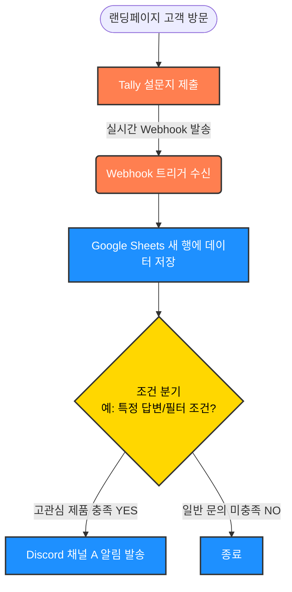

# 프로젝트 1. 노코드 자동화 도구 비교 및 고객 문의 자동화 구현

## 1. 프로젝트 개요

**주제:** 랜딩페이지 Tally 문의 폼 자동 수집 및 관심도 기반 분류 자동화 워크플로우 구현

> **목적:** 본 프로젝트는 자동화 도구인 **Make**와 **n8n**을 사용하여 고객 문의 자동화 시스템을 구현하고, 두 도구의 사용성과 기능을 비교 분석하는 것을 목표로 합니다. 고객이 랜딩페이지 Tally 폼을 통해 문의를 제출하면 Webhook을 통해 데이터를 수신하고 정보를 Google Sheets에 저장합니다. 또한, 고관심 제품 문의의 경우 Discord Webhook을 통해 별도 알림을 발송하도록 구성하였습니다.

## 2. 사용 도구

| 도구 | 사용 목적 |
| --- | --- |
| Tally | 고객 문의 폼 생성 및 Webhook 데이터 전송 |
| Make | 자동화 워크플로우 구현 1 |
| n8n | 자동화 워크플로우 구현 2 |
| Google Sheets | 문의 데이터 저장 |
| Discord Webhook | 고관심 문의 알림 발송 |

## 3. 자동화 시나리오

### 전체 흐름

```
랜딩페이지 Tally 문의 폼 제출
        ↓
Webhook 데이터 수신
        ↓
데이터 가공
- 연락처 형식 변환
- 제품 ID를 제품명으로 변환
- 접수일시를 한국시간으로 변환
        ↓
문의 분류 및 처리상태 설정
        ↓
Google Sheets에 저장
        ↓
고관심 문의인 경우 Discord 알림 발송
```

## 4. Google Sheets 저장 컬럼

Google Sheets에는 총 10개의 컬럼을 구성하였다.

| 컬럼명 | 설명 |
| --- | --- |
| 접수일시 | 문의가 접수된 시간, KST 기준 |
| 회사명 | 회사 이름 |
| 담당자 | 고객 이름 |
| 이메일 | 고객 이메일 |
| 연락처 | 변환된 연락처 형식 |
| 관심제품 | 제품 ID를 제품명으로 변환한 값 |
| 문의내용 | 고객이 작성한 문의 내용 |
| 개인정보동의 | 동의 여부 |
| 문의유형 | 고관심 또는 일반 문의 |
| 처리상태 | 알림대상 여부 판별 |

## 5. 도구별 구현 과정

### 📸 A. Make

Make에서는 Tally Webhook으로 데이터를 수신한 뒤, 데이터 가공과 조건 분기를 거쳐 Google Sheets 저장 및 Discord 알림을 수행하였다.

### Make 워크플로우 구성

```
Tally Webhook
        ↓
데이터 가공
        ↓
Router
   ├─ 고관심 문의 경로
   │    ├─ Google Sheets 저장
   │    └─ Discord 알림 발송
   │
   └─ 일반 문의 경로
        └─ Google Sheets 저장
```

**결과 확인:** Google Sheets에 데이터가 들어간 행 + Discord 채널 알림 메시지

<p align="center">
  
</p>


### 📸 B. n8n

n8n에서는 Webhook 노드로 Tally 데이터를 수신하고, Code 노드에서 데이터 가공을 수행한 뒤 IF 노드를 통해 고관심 문의와 일반 문의를 분기하였다.

### n8n 워크플로우 구성

```
Webhook
   ↓
Code
   ↓
IF
 ├─ true: 고관심 문의
 │     ├─ Google Sheets 저장
 │     └─ Discord 알림 발송
 │
 └─ false: 일반 문의
       └─ Google Sheets 저장
```

**결과 확인:** n8n을 통해 저장된 Google Sheets 행 + Discord 채널 알림 메시지

<p align="center">
  
</p>

### 📸 C. Google Sheets
Google Sheets에는 Make와 n8n에서 처리된 고객 문의 데이터가 정상적으로 저장되었다.

<p align="center">
  
</p>

### 📸 D. Discord 알림 메시지
고관심 문의가 접수되었을 때 Discord로 아래와 같은 알림을 발송하였다.

```
🚨 고관심 문의가 접수되었습니다!

이름: 홍길동
이메일: test@example.com
연락처: 010-1234-5678
관심제품: 스마트 워치
문의분류: 고관심 문의
처리상태: 우선 상담 필요
문의내용: 제품 구매 상담을 받고 싶습니다.
```

## 6. 비교 분석 보고서

### 6.1 워크플로우 구조



### 6.2 도구별 구현 요약

- **Make:** Router와 Filter를 사용하여 시각적으로 경로를 나누고, 내장 함수를 통해 데이터를 매핑함.
- **n8n:** IF 노드로 조건을 설정하고, 필요한 경우 Code(JavaScript) 노드를 활용하여 정밀하게 데이터를 가공함.

### 6.3 상세 비교 분석표

| 비교 항목 | Make | n8n | Make 점수 | n8n 점수 |
| --- | --- | --- | --- | --- |
| **UI/UX** | 아이콘 형태로 직관적이고 시각적임 | 아이콘 형태로 직관적이고 시각적임 | 5 | 5 |
| **설정 난이도** | 내장 함수 사용이 필요해 세부 설정이 다소 불편함 | **JavaScript 활용이 가능하여 데이터 가공이 편리함** | 3 | 5 |
| **버전 관리** | 시간별 복구가 편리함 | 퍼블리시 형태로 복구가 편리함 | 5 | 5 |
| **확장성** | 대중적인 SaaS 연동에 최적화되어 있음 | 커스텀 API 및 복잡한 로직 구현에 최적화되어 있음 | 5 | 5 |
| **오류 관리** | 실패 지점 시각화가 뛰어남 | 데이터 흐름 추적이 매우 정밀함 | 5 | 5 |
| **가격** | 월 1,000 크레딧 무료 제공<br>유료 플랜은 월 15,000원~27,000원 사이 | 서버를 셀프로 구축할 경우 무료로 사용 가능<br>웹에서 사용할 경우 월 40,000원~100,000원 사이 | 5 | 4 |
| **최종 선정** |  | ✅ 선정 | **28** | **29** |

## 7. 필수 체크리스트 충족 현황

### 구현

| 항목 | 완료 여부 | 내용 |
| --- | --- | --- |
| **동일한 워크플로우 선정** | ✅ 완료 | 랜딩페이지 Tally 고객 문의 자동 수집 및 분류 |
| **서로 다른 자동화 도구 2개 이상 선택** | ✅ 완료 | Make, n8n |
| **각 도구별 동일한 워크플로우 구현** | ✅ 완료 | 랜딩페이지 Tally Webhook → Google Sheets 저장 → 조건 분기 → Discord 알림 |
| **각 도구별 워크플로우 구성 화면 캡처** | ✅ 완료 | Make 시나리오 구성 화면, n8n 워크플로우 구성 캡처 |
| **각 도구별 실행 결과 화면 캡처** | ✅ 완료 | Make와 n8n에서 고관심 문의/일반 문의 실행 결과 캡처  |

### 비교 분석 보고서

| 항목 | 완료 여부 | 내용 |
| --- | --- | --- |
| **사용한 도구 이름 작성** | ✅ 완료 | Make, n8n |
| **각 도구의 구현 과정 요약 작성** | ✅ 완료 | Make: Webhook 수신 후 Formatter/Router를 이용해 데이터 가공 및 분기 처리.<br>n8n: Webhook 수신 후 Code/IF 노드를 이용해 데이터 가공 및 분기 처리 |
| **최소 5개 이상의 비교 항목 작성** | ✅ 완료 | UI/UX, 설정 난이도, 가격, 버전 관리 방식, 확장성, 오류 관리 등 |
| **각 도구의 장단점 정리** | ✅ 완료 | Make는 시각적 구성과 기본 연동이 편리하나, 데이터 가공이 복잡함.<br>n8n은 코드 기반 가공과 커스터마이징이 강점임. |
| **어떤 상황에서 각 도구가 적합한지 의견 작성** | ✅ 완료 | Make는 비개발자가 업무 자동화를 만들고 싶은 경우에 적합하고,<br>n8n은 복잡한 조건 처리나 직접 코드로 데이터를 가공해야 하는 경우에 적합함 |

<br>


## 8. 도구별 장단점 및 최종 결론

### 도구별 장단점

### 👍 Make

- **장점:** 비교적 다루기 쉽고, 화면 구성이 직관적이어서 자동화 흐름을 이해하기 쉽습니다. 비개발자가 운영하기에 최적입니다.
- **단점:** 복잡한 로직을 짤 때 모듈이 너무 많아져 비용 부담이 생길 수 있습니다. 세밀한 커스터마이징은 n8n보다 제한적입니다.

### 👍 n8n

- **장점:** Code 노드를 통해 JavaScript로 자유롭게 데이터를 가공할 수 있어, 복잡한 모듈도 쉽게 커스터마이징이 가능합니다. 코드를 몰라도 LLM 도움을 받아 쉽게 구현할 수 있습니다. 확장성이 좋습니다.
- **단점:** 초기 학습 곡선이 있으며, JSON 데이터 형식에 익숙해져야 합니다.

### 최종 결론

저는 코드를 잘 모르지만 LLM에 도움을 받아 n8n으로 더 쉽고 빠르게 자동화가 가능했습니다.
아래와 같이 상황에 따라 2가지 도구를 병행하여 사용하는 것이 좋다고 결론내렸습니다.
Make는 비용적인 부담 없이 월 주어진 1,000 크레딧 안에서 자동화 워크플로우를 운용하고,
n8n은 유료 비용이 다소 비싸 자체 호스팅으로 비용을 절감하여 사용하고자 합니다.
